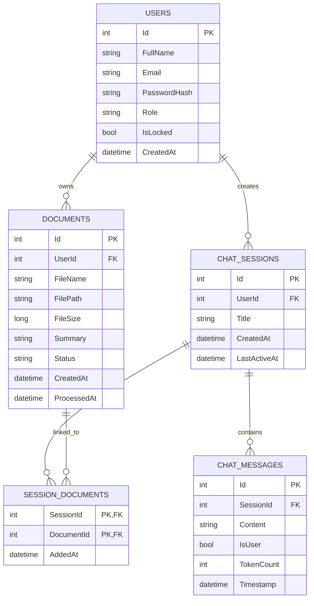

# DocuMind

## Table of Contents
- [Overview](#overview)
- [Features](#features)
- [Technology Stack](#technology-stack)
- [System Architecture](#system-architecture)
- [Database Schema](#database-schema)
- [API Documentation](#api-documentation)
- [Installation & Configuration](#installation--configuration)
- [Development Guide](#development-guide)


## Overview
DocuMind is an intelligent document management and analysis platform designed to transform how you interact with your documents. By leveraging advanced AI technologies, DocuMind enables users to upload, process, and query documents with ease. The system allows for semantic search, summarization, and interactive Q&A sessions with your document archives.

Built with a robust .NET 9 backend and a modern React frontend, DocuMind integrates powerful tools like **Google Gemini** for high-quality language processing, **Ollama** for local embedding generation, and **Qdrant** for efficient vector storage. Whether you need to extract insights from reports, compare multiple documents, or simply manage your knowledge base, DocuMind provides a seamless and smart solution.

## Features

### 🤖 Smart Document Analysis
*   **AI-Powered Chat**: Engage in natural language conversations with your documents using RAG (Retrieval-Augmented Generation).
*   **Intelligent Intent Classification**: Automatically detects user intent (QA, Summary, Explanation) to tailor responses.
*   **Document Summarization**: Instantly generate concise summaries of long documents.
*   **Vector Search**: Semantic search capability powered by Qdrant and Ollama embeddings for accurate context retrieval.

### ⚙️ Advanced Processing
*   **Hybrid Semantic Chunking**: Smart text segmentation (paragraph + sentence + structure) for optimal context retention.
*   **Asynchronous Processing**: Non-blocking document processing pipeline powered by Hangfire.
*   **Automatic Maintenance**: Self-cleaning mechanisms for failed jobs and temporary files.

### 📄 Document Management
*   **Multi-format Support**: Seamlessly upload and process PDF documents.
*   **Session-based Organization**: Manage document interactions through dedicated chat sessions.
*   **Secure Storage**: Documents are safely stored and managed via Supabase.

### 👤 User Features
*   **Secure Authentication**: Robust JWT-based authentication system.
*   **Profile Management**: Easy-to-use interface for updating user profiles and passwords.
*   **Personal Dashboard**: View recent activities, usage statistics, and document history.

### 🛠️ Admin Dashboard
*   **System Overview**: Real-time statistics on system usage and performance.
*   **User Management**: Centralized control to view, lock, unlock, or delete users.

## Technology Stack

### Backend
*   **Framework**: .NET 9 (ASP.NET Core Web API)
*   **Database**: SQL Server (Entity Framework Core)
*   **Authentication**: JWT Bearer (BCrypt.Net for password hashing)
*   **Background Jobs**: Hangfire (SQL Server storage)
*   **PDF Processing**: iText7

### AI & Machine Learning
*   **LLM Provider**: Google Gemini (via Google.GenAI SDK)
*   **Embedding Model**: Local embeddings via Ollama
*   **Vector Database**: Qdrant (for high-speed semantic search)
*   **Tokenization**: SharpToken

### Frontend
*   **Framework**: React 19 (via Vite 7)
*   **Styling**: Tailwind CSS 3
*   **HTTP Client**: Axios
*   **Routing**: React Router DOM 7

### Infrastructure & Services
*   **Storage**: Supabase (for secure file storage)
*   **Containerization**: Docker Support (implied for Ollama/Qdrant)

## System Architecture

DocuMind follows the **Clean Architecture** principles, ensuring separation of concerns, scalability, and maintainability.

### 🏗️ Monolithic Architecture (Modular)

The solution is divided into four main projects:

1.  **DocuMind.Core (Domain Layer)**
    *   Contains enterprise logic and entities.
    *   Defines interfaces for repositories and services (Repository Pattern).
    *   No external dependencies, ensuring purity.

2.  **DocuMind.Application (Service Layer)**
    *   Implements business logic (Use Cases).
    *   Contains DTOs (Data Transfer Objects), Service Interfaces, and Validation logic.
    *   Orchestrates data flow between the API and Infrastructure.

3.  **DocuMind.Infrastructure (Infrastructure Layer)**
    *   Implements interfaces defined in Core (Repositories, External Services).
    *   Manages Database Context (EF Core), File Storage (Supabase), and AI Integration (Ollama, Gemini, Qdrant).
    *   Handles Background Jobs (Hangfire) and PDF Processing (iText7).

4.  **DocuMind.API (Presentation Layer)**
    *   The entry point of the application (RESTful API).
    *   Handles HTTP Requests, Authentication (JWT), and Dependency Injection (DI).
    *   Exposes endpoints for the Frontend.

## Database Schema

The system uses **SQL Server** with a relational schema optimized for efficient retrieval and integrity.



### Key Entities

*   **Users**: Stores user credentials, roles (Admin/User), and status.
*   **Documents**: Tracks uploaded files, their processing status (Pending/Ready/Error), and generated summaries.
*   **ChatSessions**: Manages conversation history and metadata.
*   **ChatMessages**: Stores individual messages exchanged between the user and the AI.
*   **SessionDocuments**: A many-to-many link table connecting Chat Sessions with specific Documents, allowing context-aware chats.

## API Documentation

The API is documented using **Swagger/OpenAPI**. You can view the interactive documentation at `/swagger` when running the application locally.

### 🔐 Authentication (`/api/Auth`)
| Method | Endpoint | Description |
| :--- | :--- | :--- |
| `POST` | `/login` | Authenticate user & retrieve JWT token. |
| `POST` | `/register` | Register a new user account. |
| `POST` | `/change-password` | Update current user's password. |

### 📄 Documents (`/api/Document`)
| Method | Endpoint | Description |
| :--- | :--- | :--- |
| `POST` | `/sessions/{sessionId}/upload` | Upload a PDF document to a specific session. |

### 💬 Chat & Sessions (`/api/Chat`)
| Method | Endpoint | Description |
| :--- | :--- | :--- |
| `POST` | `/create-chat` | Initialize a new chat session. |
| `GET` | `/sessions` | Retrieve all chat sessions for the user. |
| `GET` | `/sessions/{sessionId}` | Get details of a specific session. |
| `POST` | `/sessions/{sessionId}/messages` | Send a message to the AI (RAG inference). |
| `GET` | `/sessions/{sessionId}/messages` | Retrieve message history for a session. |

### 👤 User Management (`/api/User`)
| Method | Endpoint | Description |
| :--- | :--- | :--- |
| `GET` | `/profile` | Get current user's profile details. |
| `PUT` | `/profile` | Update user profile information. |

### 🛡️ Admin (`/api/Admin`)
| Method | Endpoint | Description |
| :--- | :--- | :--- |
| `GET` | `/dashboard` | Get system-wide statistics. |
| `GET` | `/users` | List all registered users. |
| `DELETE` | `/users/{id}` | Permanently delete a user. |
| `POST` | `/users/{id}/lock` | Lock a user account (prevent login). |
| `POST` | `/users/{id}/unlock` | Unlock a user account. |

## Installation & Configuration

## Installation & Configuration

### Prerequisites
Before starting, ensure your development environment is ready:

*   **Operating System**: Windows / macOS / Linux
*   **.NET 9 SDK**: [Download here](https://dotnet.microsoft.com/en-us/download/dotnet/9.0) - Verify with `dotnet --version`
*   **SQL Server 2022+**: Local instance or Docker container.
*   **Docker Desktop**: Required for running Qdrant and optionally SQL Server.
*   **Qdrant Vector DB**:
    *   Run via Docker: `docker run -p 6333:6333 -p 6334:6334 qdrant/qdrant`
*   **Ollama**: [Download here](https://ollama.com/)
    *   Pull the embedding model: `ollama pull mxbai-embed-large`
    *   Ensure Ollama is running on port `11434`.

### ⚙️ Backend Setup (Detailed)

#### 1. Clone & Restore
```bash
git clone https://github.com/thanh2323/DocuMind-AI.git
cd DocuMind /BE
dotnet restore
```

#### 2. Configuration (`appsettings.json`)
The backend requires sensitive credentials to function. Open `src/DocuMind.API/appsettings.json` and configure the following sections:

**Database Connection**
Ensure your SQL Server is running and accessible.
```json
"ConnectionStrings": {
  "DefaultConnection": "Server=localhost;Database=DocuMindDb;Trusted_Connection=True;TrustServerCertificate=True;"
}
```

**AI & Storage Services**
*   **Supabase**: Create a project at [supabase.com](https://supabase.com). Go to Project Settings -> API to get URLs and Keys. Create a storage bucket named `documents`.
*   **Gemini**: Get your API key from [Google AI Studio](https://aistudio.google.com/).
*   **JWT**: Generate a random 32+ character string for security.

```json
"JwtSettings": {
  "Secret": "YOUR_SUPER_SECURE_SECRET_KEY_MIN_32_CHARS_HERE"
},
"Supabase": {
  "Url": "https://your-project-id.supabase.co",
  "ApiKey": "your-anon-public-key",
  "Bucket": "documents"
},
"Gemini": {
    "ApiKey": "AIzaSy..."
}
```

#### 3. Database Initialization
Apply Entity Framework Core migrations to create the database schema.
```bash
# Run from the /BE directory
dotnet ef database update -s src/DocuMind.API -p src/DocuMind.Infrastructure
```
*If this fails, ensure you have the EF Core tool installed globally:* `dotnet tool install --global dotnet-ef`

#### 4. Running the Application
Start the backend API.
```bash
dotnet run --project src/DocuMind.API
```

#### 5. Verification
*   **Swagger UI**: Visit `http://localhost:7266/swagger` to explore endpoints.
*   **Hangfire Dashboard**: Visit `http://localhost:7266/hangfire` to monitor background jobs.

### 💻 Frontend Setup (Detailed)

#### 1. Navigate to Directory
```bash
cd DocuMind/FE
```

#### 2. Install Dependencies
Install all required Node.js packages.
```bash
npm install
```

#### 3. Configuration (`.env`)
Create a file named `.env` in the root of the `FE` directory to point to your backend API.

```env
# Point this to your running .NET API URL
VITE_API_URL=http://localhost:7266/api
```

#### 4. Running the Application
Start the development server.
```bash
npm run dev
```

#### 5. Usage
Open your browser and navigate to the URL shown in the terminal (usually `http://localhost:5173`).
*   **Sign Up**: Create a new account.
*   **Login**: Access your dashboard.
*   **Dashboard**: Manage your documents and start chatting!

## Development Guide


### 📂 Key Directory Structure

*   `BE/src/DocuMind.Core`: **Domain Entities & Interfaces**. The heart of the application.
*   `BE/src/DocuMind.Application`: **Business Logic**. Services, DTOs, and Validators.
*   `BE/src/DocuMind.Infrastructure`: **Implementation**. EF Core, Hangfire, and External Services.
*   `BE/src/DocuMind.API`: **Entry Point**. Controllers and Middleware.
*   `FE/src/pages`: React Page Components (Admin, Chat, Dashboard).
*   `FE/src/services`: API Integration logic (Axios).

### 🐛 Common Issues & Fixes

*   **CORS Errors**: Ensure `appsettings.json` allows the frontend URL (default `http://localhost:5173`).
*   **Hangfire Database Error**: Ensure SQL Server is running and the connection string is valid before starting the app.
*   **Ollama Connection Refused**: Make sure Ollama is running (`ollama serve`) and the model is pulled (`ollama list`).

---
Start building with **DocuMind** today! 🚀


